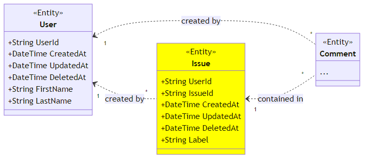
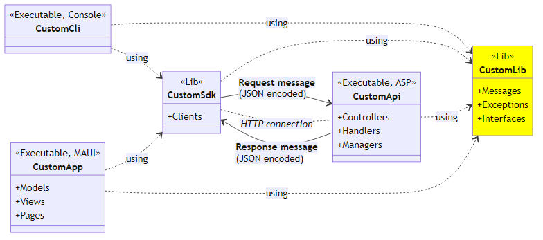
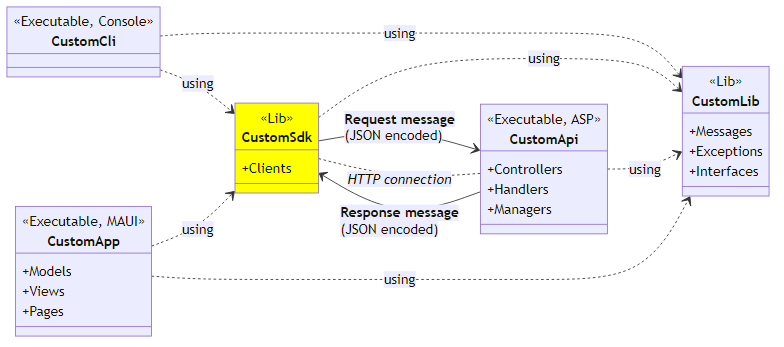
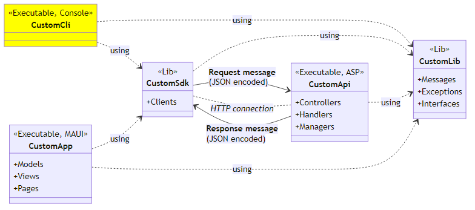
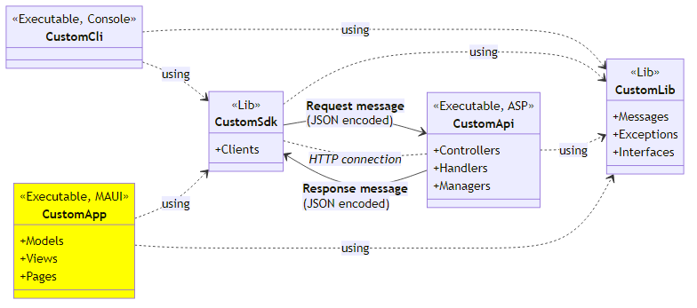
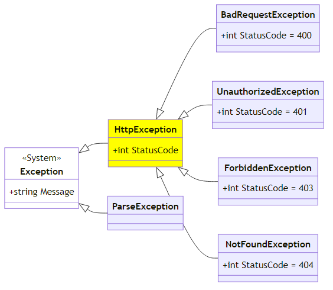
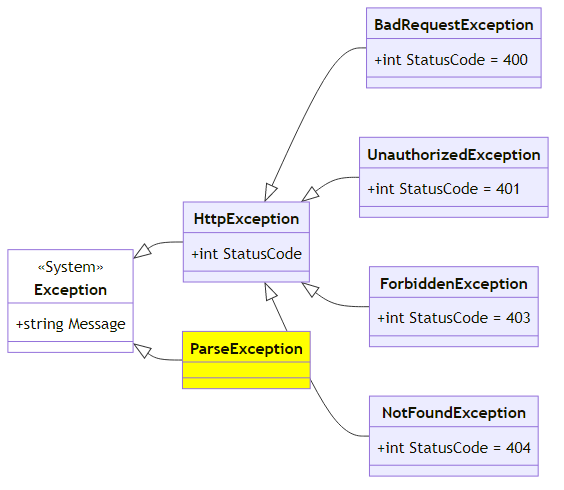

<!-- _class: clean center -->

# C# MAUI.NET / ASP.NET Sample Application

**Dr. Georg Hackenberg BSc MSc**

Professor for Industrial Informatics | School of Engineering
University of Applied Sciences Upper Austria
Stelzhamerstr. 23, 4600 Wels, Austria

👤 https://github.com/ghackenberg
👤 https://linkedin.com/in/georghackenberg
👤 https://youtube.com/@georghackenberg

Also check out https://mentawise.com and https://caddrive.org 😎

---

## Deck overview

- **Section 1 - The software architecture**
- **Section 2 - The `CustomLib` component**
- **Section 3 - The `CustomApi` component**
- **Section 4 - The `CustomSdk` component**
- **Section 5 - The `CustomCli` component**
- **Section 6 - The `CustomApp` component**
- **Section 7 - The follow-up resources**

---

<!-- _class: center dark -->

## Section 1 - The software architecture

**Domain** and **component model**

---

<!-- _class: center -->

### Domain model

The **entities**, their **attributes**, and their **relationships**

---

#### Domain model overview

The diagram on the right shows the **domain model** implemented by the application.

The data model consists of **three entities**, namely `User`, `Issue`, and `Comment`.

Issues and comments are `created by` users, comments are `contained in` issues.

---

#### The `User` entity

The `User` entity represents, as the name suggests, the users of the sample application.

For each user, **a first and a last name** must be defined, which are shown in the GUI.

Furthermore, each user has a unique **identifier** as well as create, update, and delete timestamps.

---

#### The `Issue` entity

The `Issue` entity represents problems with some machine reported by the users.

Each issue carries the identifier of the corresponding user as well as a **label** explaning the issue.

Also, each issue has a unique **identifier** as well as a create, update, and delete timestamp.

---

#### The `Comment` entity

Finally, the `Comment` entity represents, as the name suggests, comments associated to issues.

For each comment, the identifier of the corresponding user and a **text** is defined.

Moreover, each comment has a unique **identifier** as well as a create, update, and delete timestamp.

---

<!-- _class: center -->

### Component model

**Components** and their **dependencies / interactions**

---

### Component model overview

The sample application comprises **two library** and **three executable** components.

The **library components** include the `CustomLib` and the `CustomSdk` components.

The **executable components** include the `CustomApi`, the `CustomCli`, and the `CustomApp` components.

---

### The `CustomLib` component

The `CustomLib` contains a common set of **classes and interfaces** used by the other components.

Most importantly, the `CustomLib` defines the **messages** exchanged between backend and frontends.

Furthermore, the `CustomLib` defines the **contracts** between backend and frontends as *regular interfaces*.

---

### The `CustomApi` component

*Coming soon*

---

### The `CustomSdk` component

*Coming soon*

---

### The `CustomCli` component

*Coming soon*

---

### The `CustomApp` component

*Coming soon*

---

<!-- _class: center dark -->

## Section 2 - The `CustomLib` component

**Messages**, **interfaces**, and **exceptions**

---

<!-- _class: center -->

### Messages

**Data exchange** between frontends and backend

---

#### Message overview

The REST API uses request and response **messages** for working with these entities.

For **each resource** (i.e. user, issue, comment) we distinguish `Get`, `Post`, and `Put` messages.

In the following, we describe each **type of message** in more detail including their data fields.

---

#### `Put` messages

The `Put` messages contain the fields that you can **override later** after creating an instance.

For `User` entities, **the first and the last name** can be changed any time later.

For `Issue` entities, the **label** can be changed later, and for `Comment` entities the **text**.

---

#### `Post` messages

The `Post` messages derive from the `Put` messages and add the fields that you can **set initially only**.

For `Issue` entities you must define the identifier of the **user** who created the issue.

For `Comment` entities you must define the identifier of the **user** as well as the containing **issue**.

---

#### `Get` messages

Finally, the `Get` messages derive from the `Post` messages and add the fields that are **read-only**.

For all entities the read-only fields include the **unique entity identifier** selected randomly on creation.

Furthermore, the read-only fields include **create, update, and delete timestamps** managed automatically.

---

<!-- _class: center -->

### Interfaces

**Methods** *provided by* backend and *required by* frontends

---

#### Interface overview

Based on the message data structures we **define the methods** of the REST API.

We use a **generic interface** model including `List`, `Post`, `Get`, `Put`, and `Delete` methods.

In the following, we explain each method **in more detail** including its inputs and outputs.

---

#### The `List` method

The `List` method returns a **collection** of created (and *not* deleted) instances.

Note that in our case the method **does not require** any input parameters.

*Usually the input parameters are used for **filtering and paging** the instances on demand.*

---

#### The `Post` method

The `Post` method **creates and returns** new instances of a given entity type.

The **input parameters** use the corresponding `Post` message defined previously.

The **return type** corresponds to the respective `Get` message from before.

---

#### The `Get` method

The `Get` method **returns** an existing instance with a given identifier.

The **single input parameter** represents the identifier of the desired instance.

The **return type** corresponds to the respective `Get` message from before.

---

#### The `Put` method

The `Put` method **overrides and returns** an existing instance with a given identifier.

The **two input parameters** are the identifier of the instance and the respective `Put` message.

The **return type** corresponds to the respective `Get` type as introduced before.

---

#### The `Delete` method

Finally, the `Delete` method **deletes and returns** an existing instance with a given identifier.

Note that deleting an instance **does not remove** the dataset from the database.

Instead, the `DeletedAt` timestamp of the instance is **set to the current timestamp**.

---

<!-- _class: center -->

### Exceptions

**Potential problems** during method execution

---

#### Exception overview

*Coming soon*

---

#### HTTP exception

*Coming soon*

---

#### Bad request exception

*Coming soon*

---

#### Unauthorized exception

*Coming soon*

---

#### Forbidden exception

*Coming soon*

---

#### Not found exception

*Coming soon*

---

#### Parse exception

*Coming soon*

---

<!-- _class: center dark -->

## Section 3 - The `CustomApi` component

**ASP.NET backend** and **controllers**

---

### ASP.NET backend

The data itself is managed by an **ASP.NET backend** service with standard REST API.

The screenshot on the right provides an **overview** of the API services exposed.

For each **resource** (i.e. user, issue, comment), the same set of functions is defined.

---

<!-- _class: center -->

### Controllers

*Coming soon*

---

### Controller overview

*Coming soon*

---

<!-- _class: center dark -->

## Section 4 - The `CustomSdk` component

*Coming soon*

---

### Software development kit (SDK)

*Coming soon*

---

<!-- _class: center dark -->

## Section 5 - The `CustomCli` component

*Coming soon*

---

### Command line interface (CLI)

*Coming soon*

---

<!-- _class: center dark -->

## Section 6 - The `CustomApp` component

**MAUI.NET frontend**, **view models**, and **pages**

---

### MAUI.NET frontend

The C# MAUI.NET / ASP.NET Sample Application features a **basic** graphical user interface (GUI).

With the GUI you can manage the **users** and the **issues** stored in the underlying database.

The screenshot on the right shows the **users page** listing all created user entities.

---

### MAUI.NET frontend (cont'd)

When clicking an existing user or creating a new user, you enter the **user detail** page.

The user detail page shows all the **data associated** with a user entity in the database.

You can change the **first and last name**, the other fields are set automatically.

---

<!-- _class: center -->

### View models

*Coming soon*

---

### View model overview

*Coming soon*

---

<!-- _class: center -->

### Pages

*Coming soon*

---

### Page overview

*Coming soon*

---

<!-- _class: center dark -->

## Section 7 - The follow-up resources

*Coming soon*

---

### Follow-up resource overview

*Coming soon*

---

<!-- _class: center dark -->

## You are ready to code 👩‍💻

Well done!