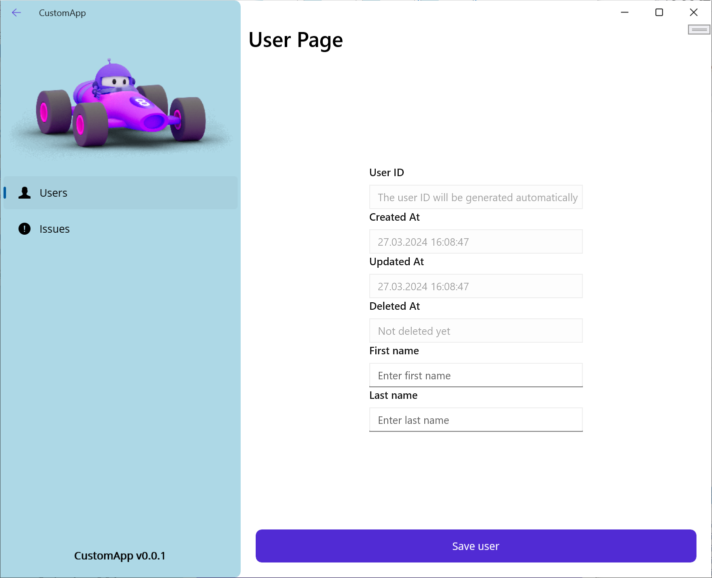

# C# MAUI.NET / ASP.NET Sample

**This project contains a sample application based on the awesome Microsoft MAUI.NET and ASP.NET frameworks.**

We use this sample project at the [School of Engineering](https://www.fh-ooe.at/campus-wels/) of the [University of Applied Sciences Upper Austria](https://www.fh-ooe.at/) in [Wels, Austria](https://www.wels.at/) for teaching courses in **Mobile and Cloud Computing** to our engineering and management students. Since we mainly use C# as a language and DotNet as a framework in our programming courses in the earlier semester, we decided to use the  MAUI.NET and ASP.NET frameworks in this course. The MAUI.NET and ASP.NET frameworks provide the following capabilities:

- [MAUI.NET](https://dotnet.microsoft.com/en-us/apps/maui) supports building **cross-platfrom graphical user interfaces (GUIs)**.
- [ASP.NET](https://dotnet.microsoft.com/en-us/apps/aspnet) supports building **Cloud services with state-of-the-art REST APIs**.

## 📝 Guides

The following set of guides helps you **getting started with MAUI.NET and ASP.NET development on your local machine**. Note that the guides have been prepared for Windows machines only. In principle, MAUI.NET and ASP.NET development should be possible also on OS X and Linux machines. However, we did not test that!

- [**Guide 1 - Create your personal GitHub account**](./Guides/0_Register/README.md)
- [**Guide 2 - Fork the respository** of the sample application](./Guides/1_Fork/README.md)
- [**Guide 3 - Prepare your development environment**](./Guides/2_Prepare/README.md)
- [**Guide 4 - Clone the sources** of the sample application](./Guides/3_Clone/README.md)
- [**Guide 5 - Build and run** the sample application](./Guides/4_Run/README.md)
- [**Guide 6 - Make changes** to the sample application](./Guides/5_Change/README.md)

## 📜 Documents

As for every open source project, we provide **three standard documents**: The license agreement for using the source code, rules for contributing to the source code of the project, and a change log summarizing relevant changes to the source code:

- [License](./LICENSE.md)
- [Contributing](./CONTRIBUTING.md)
- [Changelog](./CHANGELOG.md)

## 📸 Screenshots

In the following, we provide screenshots of the sample application to give a first impression of its functionality. The following screenshots are included:

1. **MAUI.NET Users Page** provides a list of existing users
2. **MAUI.NET User Page** provides details of one user
3. **ASP.NET Swagger UI** provides the REST API documentation

### MAUI.NET Users Page

The **MAUI.NET Users Page** provides a list of existing users, allows you to reload the list of existing users, and provides means for editing existing users or creating new users. The users are retrieved from the backend service.

### MAUI.NET User Page

The **MAUI.NET User Page** provides means for editing the information of existing users or entering the information of new users and sending the information to the Cloud-based backend services for long-term storage.

### ASP.NET Swagger UI

The **ASP.NET Swagger UI** provides a documentation of the Cloud-based backend services, which are exposed via HTTP REST API. For each endpoint, the expected inputs and provided outputs are shown including examples.

## 📈 Structures

In the following, we explain internal structures of the sample application. We divided the expanation into the following subsections:

1. **Package structure** describes the C# packages (i.e. DLLs and EXEs) and their relations.
2. **Data structure** describes the database entities, their attributes, and their relations.
3. **Message structure** describes the structure of the HTTP request and response messages.
4. **Interface structure** describes the interfaces and methods of the backend services.

### Package structure

The following diagram explains the package structure of the sample application. The package structure consists of three projects: A MAUI.NET application project, an ASP.NET werb service project, and a common class library project. Furthermore, the MAUI.NET application communicates with the ASP.NET web service via HTTP REST protocol.

### Data structure

The following diagram explains the data structrure of the sample application: The data structure consists of three classes: A user class representing the users of the application, an issue class representing the issues created by the users, and a comment class representing comments created by the users and contained in issues.

### Message structure

The following diagram explains the message structure of the sample application used for communication between the graphical user interface and the service via HTTP REST. For each entity (i.e. user, issue, comment), the structure of the HTTP responses as well as the HTTP POST and HTTP PUT requests are described.

### Interface structure

The following diagram explains the interface structure of the sample application. For each entity (i.e. user, issue, comment), methods are provided for listing all existing entity instances, creating a new instance, getting an existing instance, updating an existing instance, and deleting an existing instance.

### Page structure

The following diagram explains the page structure and the underlying view models of the MAUI.NET sample application. At the base you find an abstract view model, which implements the ``INotifyPropertyChanged`` interface. On top of the abstract view model, you find an abstract collection view model as well as an abstract item view model. The collecton view model forms the basis of the user and issue overview pages. The item view model instead forms the basis of the user and item detail pages.

